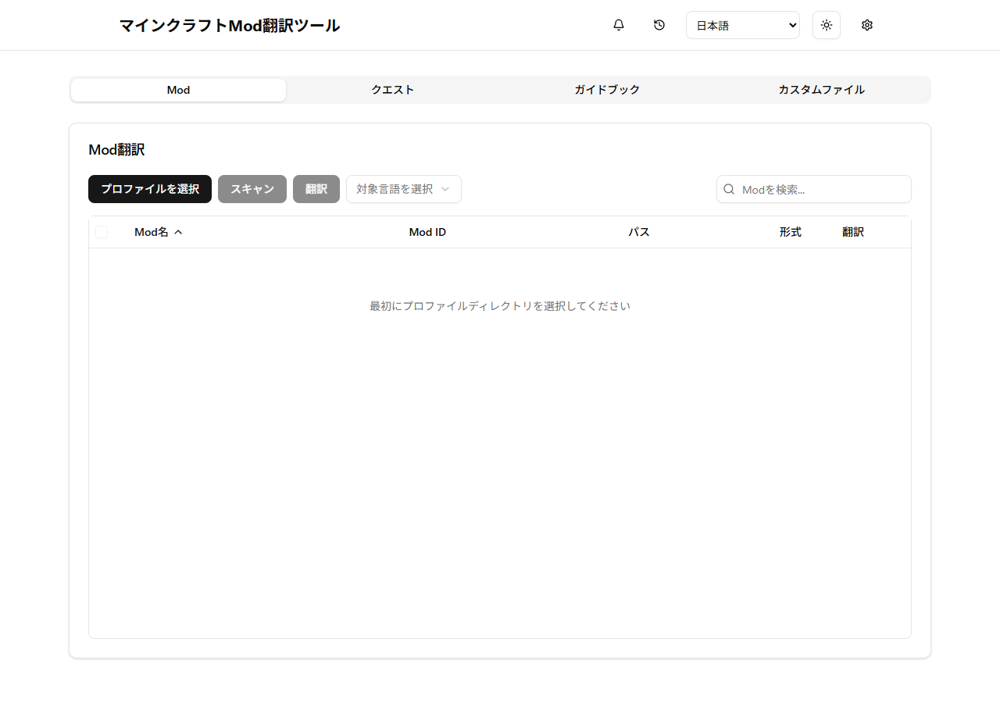

# Minecraft Mods Localizer

[English](README.md) | [日本語](README.ja.md)

AIを使ってMinecraftのModやModpackを翻訳する、Windows・macOS・Linux対応のデスクトップアプリです。Modの言語ファイル、FTB Quests、Patchouliのガイドブック、対応するJSON/SNBTファイルを日本語などの任意の言語へ翻訳します。Tauri、Rust、TypeScriptで開発しています。

**はじめに：** [ダウンロード](https://github.com/Y-RyuZU/MinecraftModsLocalizer/releases) · [最初の翻訳とトラブル対処](docs/ja/getting-started.md) · [APIキー取得](docs/ja/api-key-setup.md) · [English guide](docs/getting-started.md)

このREADMEは開発中のv3を説明しています。v3.0.0公開まではv2.1.3が公開最新版で、画面や配布ファイル名は異なります。



現行フロントエンドのプレビューです。デスクトップのファイル操作・実際の翻訳完了は別途検証します。[短いチュートリアル](docs/ja/getting-started.md#modを1つ翻訳する)。

## 主な機能

- Modの言語ファイルから翻訳リソースパックを作成
- FTB Quests、Better Quest、Patchouliガイドブック、JSON/SNBTに対応
- OpenAI、Anthropic、Google Geminiから翻訳モデルを選択
- 進捗表示、キャンセル、バッチ処理
- Tauriによる署名検証付きアップデート
- 日本語、簡体字中国語、韓国語、ドイツ語、フランス語、スペイン語、イタリア語、ブラジルポルトガル語、ロシア語を標準搭載。Minecraftの言語IDを指定して独自言語も設定可能

アプリの表示言語は、英語・日本語・簡体字中国語・韓国語・ドイツ語・フランス語・スペイン語・イタリア語・ブラジルポルトガル語・ロシア語から選べます。日本語・英語以外のUI文言は機械翻訳のため、不自然な表現が含まれる場合があります。改善提案を歓迎します。ゲーム内の翻訳先言語は表示言語とは別に選択でき、標準言語や独自のMinecraft言語IDに対応しています。

## インストールと使い方

[Releases](https://github.com/Y-RyuZU/MinecraftModsLocalizer/releases)から、お使いのOS向けインストーラーをダウンロードしてください。

AI翻訳を使うには、プロバイダーのAPIキーが必要です。**Settings → LLM Settings**（設定 → LLM設定）からプロバイダーを選び、キーを入力して保存します。

- [OpenAI APIキーの取得・設定ガイド（日本語）](docs/ja/api-key-setup.md)
- [OpenAI API key setup (English)](docs/api-key-setup.md)
- [Tauri Updaterとリリース署名の管理（日本語）](docs/ja/updater.md)
- [Updater and release signing (English)](docs/updater.md)

API利用料は各プロバイダーから請求され、ChatGPTのサブスクリプションとは別です。APIキーをアプリへ共通埋め込みすることはありません。現在のバージョンでは、設定に入力したキーはOSの資格情報ストアで暗号化されず、ローカルのアプリ設定`config.json`に保存されます。PCのユーザーアカウントを保護し、このファイルを共有・同期しないでください。

## かんたんな使い方

ヘッダーの言語メニューでアプリの表示言語を選べます。翻訳処理ごとに選ぶ翻訳先言語とは別の設定です。

1. 歯車の**Settings**を開き、**LLM Settings**でプロバイダーとモデルを選び、自分のAPIキーを入力して保存します。[APIキーの取得ガイド](docs/ja/api-key-setup.md)も参照してください。API利用料が発生するため、最初は少数の項目で試してください。
2. **Mods / Quests / Guidebooks / Custom Files**から対象を選びます。**Select Profile Directory**では`mods`と`config`が入っているMinecraftのゲームディレクトリを指定します。Prism Launcherなら通常`instances/<インスタンス名>/minecraft`で、その一つ上のインスタンスフォルダではありません。
3. 翻訳先の言語を選び、**Scan**で対象を読み込んで一覧を確認し、翻訳したい項目を選んで**Translate**を押します。進捗・ログ画面で処理状況とエラーを確認できます。
4. Mod翻訳は選択したゲームディレクトリの`resourcepacks`にリソースパックとして作成されます。Minecraftの**Options → Resource Packs**で有効にしてください。クエストなどプロファイル内のファイルを書き換える前に、インスタンスをバックアップしてください。

## 開発

必要なもの：Rust 1.90以降、Node.js 24 LTS、Bun。依存関係を入れて起動します。

```sh
git clone https://github.com/Y-RyuZU/MinecraftModsLocalizer.git
cd MinecraftModsLocalizer
bun install
bun run tauri dev
```

テストは`bun run test:jest`、ビルドは`bun run tauri build`です。リリース手順は英語版の[Updater guide](docs/updater.md)も参照してください。

## 翻訳への協力

世界中の利用者が使いやすくなるよう、READMEやアプリ表示の翻訳を歓迎します。英語の原文は`public/locales/en/common.json`、日本語訳は`public/locales/ja/common.json`です。他の8言語は英語からの機械翻訳です。文言を追加・変更するときは、各言語ファイルのキー構造と`{{...}}`形式の変数を一致させてください。機械翻訳の修正もPull Requestで歓迎します。

## ライセンス

[MIT License](LICENSE)
