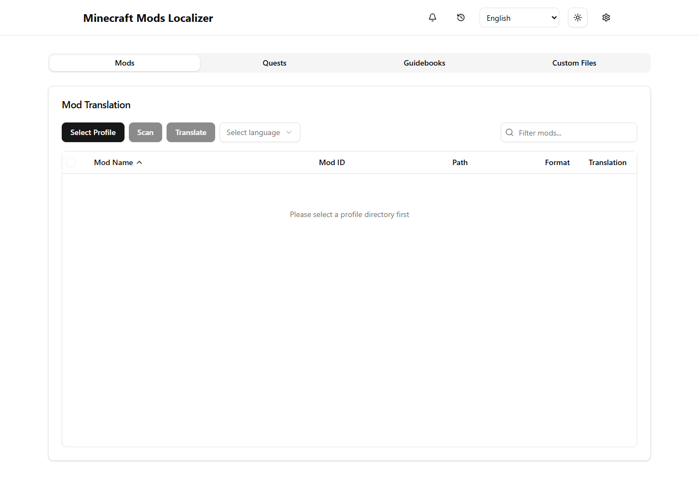

# Minecraft Mods Localizer

[English](README.md) | [日本語](README.ja.md)

[](https://github.com/Y-RyuZU/MinecraftModsLocalizer/actions/workflows/build.yml)
[](https://github.com/Y-RyuZU/MinecraftModsLocalizer/releases/latest)
[](LICENSE)

A cross-platform desktop app for AI-powered Minecraft mod and modpack localization. Translate mod language files, FTB Quests, Patchouli guidebooks, and supported JSON/SNBT files into Japanese or another target language. Built with Tauri, Rust, and TypeScript.

**Start here:** [Download](https://github.com/Y-RyuZU/MinecraftModsLocalizer/releases) · [First translation and troubleshooting](docs/getting-started.md) · [API key setup](docs/api-key-setup.md) · [日本語ガイド](docs/ja/getting-started.md)

This README describes v3. Check the version on the download page. Use the v3 installer when upgrading from v2.



Current frontend preview; desktop file access and a completed translation are verified separately. [Short tutorial](docs/getting-started.md).

## Features

- **Mod Translation**: Translates mod language files and outputs them as resource packs
- **Quest Translation**: Supports FTB Quests and Better Quests translation
  - Supports multiple FTB Quest directory structures:
    - Standard: `config/ftbquests/quests/`
    - FTB Interactions Remastered: `config/ftbquests/normal/`
    - Nested categories and deeply nested quest structures
- **Patchouli Guidebook Translation**: Translates Patchouli guidebooks within mod JAR files
- **Multi-Language Support**: Built-in targets include Japanese, Simplified Chinese, Korean, German, French, Spanish, Italian, Brazilian Portuguese, and Russian; custom language IDs are supported too
- **AI-Powered**: Uses advanced language models for high-quality translations
- **Provider Choice**: Connect your own OpenAI, Anthropic, or Google Gemini API key
- **Signed Updates**: Tauri's updater verifies signed update artifacts before installation
- **Progress Tracking**: Real-time progress display with interrupt capability
- **Batch API**: Optional asynchronous translation through OpenAI, Anthropic, or Gemini; configure it separately for each provider

The app interface can be selected in English, Japanese, Simplified Chinese, Korean, German, French, Spanish, Italian, Brazilian Portuguese, or Russian. Additional UI translations are machine-generated and may contain awkward wording; corrections are welcome. Translation output is separate and supports built-in and custom Minecraft languages.

## Installation

Download the latest release for your platform from the [Releases](https://github.com/Y-RyuZU/MinecraftModsLocalizer/releases) page:

- **Windows**: Download the `.exe` or `.msi` installer
- **macOS**: Download the `.dmg` file (Intel or Apple Silicon)
- **Linux**: Download the `.AppImage` or `.deb` package

To translate with an AI provider, create your own API key and enter it in **Settings → LLM Settings**. [OpenAI key setup](docs/api-key-setup.md) · [日本語ガイド](docs/ja/api-key-setup.md)

API usage is billed by the provider and is separate from ChatGPT subscriptions. The desktop app saves keys in the operating system credential store and removes them from `config.json` on save. See the [API key security guide](docs/api-key-setup.md#where-the-key-is-stored).

The app checks for published releases and installs updates only after Tauri verifies their signatures. See [Updater and release maintenance](docs/updater.md) if you maintain this project.

## Quick start

Choose the app language from the language menu in the header. This is separate from the target language selected for a translation job.

1. Open **Settings** (the gear button) → **LLM Settings**, choose a provider and model, enter your own API key, and save. See the [API key guide](docs/api-key-setup.md). API calls are billed by your provider, so start with a small selection.
2. Open **Mods**, **Quests**, **Guidebooks**, or **Custom Files**. Select the Minecraft game directory itself—the folder containing `mods` and `config`. For Prism Launcher, this is usually `instances/<instance>/minecraft`, not the instance folder above it.
3. Choose a target language, click **Scan**, review the detected items, then click **Translate**. The progress/log dialog shows what is running and any errors.
4. Mod translations are written as a resource pack under the selected directory's `resourcepacks` folder; enable that pack in Minecraft's **Options → Resource Packs**. Back up the instance before translating quests or other files that are written into the profile.

## Development

### Prerequisites

- [Rust](https://rustup.rs/) (1.90 or later)
- [Node.js](https://nodejs.org/) (24 LTS)
- [Bun](https://bun.sh/) (latest version)

### Setup

1. Clone the repository:
```bash
git clone https://github.com/Y-RyuZU/MinecraftModsLocalizer.git
cd MinecraftModsLocalizer
```

2. Install dependencies:
```bash
bun install
```

3. Run in development mode:
```bash
bun run tauri dev
```

### Building

To build the application for your current platform:

```bash
bun run tauri build
```

## CI/CD Pipeline

This project uses GitHub Actions for continuous integration and deployment.

### Workflows

1. **Build and Release** (`build.yml`)
   - Triggered on pushes to main, tags, and pull requests
   - Runs tests, linting, and type checking
   - Builds release artifacts for Windows, macOS (Intel & ARM), and Linux (PR validation runs separately)
   - Creates draft releases for version tags

2. **PR Validation** (`pr-validation.yml`)
   - Validates pull requests with linting, formatting, and tests
   - Runs security scans with cargo audit

3. The release job includes Tauri-signed updater artifacts and generates the platform `latest.json` before creating a draft release.

### Release Process

1. Keep `package.json`, `src-tauri/tauri.conf.json`, `src-tauri/Cargo.toml`, and the app entry in `src-tauri/Cargo.lock` in sync; run `python scripts/prepare-release.py --check-version`
2. Commit and push changes
3. Create and push a version tag:
   ```bash
   git tag v3.0.0
   git push origin v3.0.0
   ```
4. GitHub Actions builds installers, updater bundles and signatures, then creates a draft release containing `latest.json`
5. Verify the draft assets and manifest, edit release notes, and publish. The in-app updater will only see a published release.

Release signing setup and checks are documented in [docs/updater.md](docs/updater.md).

## Testing

Run the test suite:

```bash
# Run Bun unit tests
bun run test

# Run with Jest
bun run test:jest

# Run with coverage
bun run test:coverage

# Check release preparation (Python 3.11+)
python -m unittest discover -s scripts -p 'test_*.py'
```

## Contributing

Contributions are welcome! Please feel free to submit a Pull Request.

You can help make the app easier to discover and use worldwide by contributing a README or UI translation. The source of truth for interface strings is `public/locales/en/common.json`; Japanese translations are in `public/locales/ja/common.json`. The other eight UI locales are machine-generated from English. When updating strings, keep every locale's key structure and `{{...}}` interpolation variables in sync; review and improve machine-translated wording in pull requests.

## Code Rabbit


## License

This project is licensed under the MIT License - see the [LICENSE](LICENSE) file for details.
