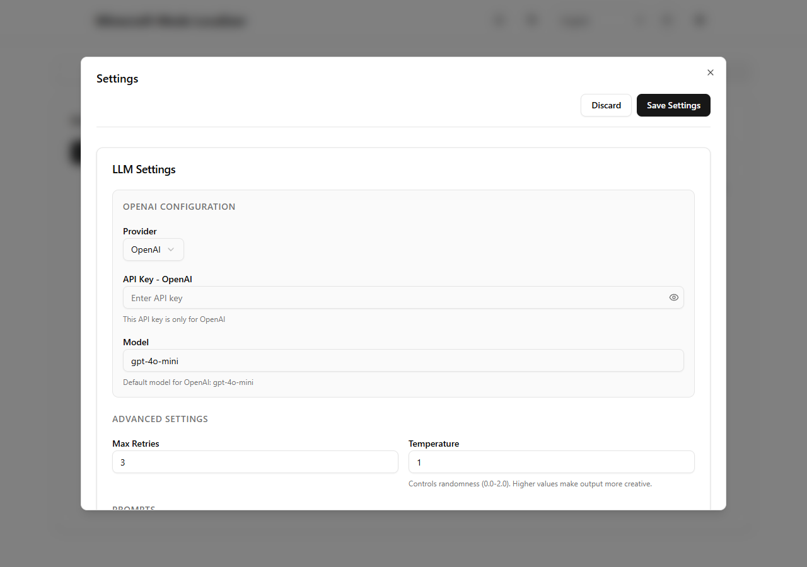

# API key setup and safety

[English](api-key-setup.md) | [日本語](ja/api-key-setup.md) | [First translation](getting-started.md)

Minecraft Mods Localizer sends translation text directly from your app to the AI provider you select. You use your own provider account and pay that provider for API usage. A ChatGPT subscription does not include OpenAI API usage; API billing is managed separately.

## Create an OpenAI API key

1. Sign in to the [OpenAI API Platform](https://platform.openai.com/).
2. Open the [API keys page](https://platform.openai.com/api-keys) and create a new secret key. Copy it when it is shown; the full secret may not be shown again.
3. Configure API billing separately from ChatGPT if the API Platform asks you to. Check usage and project limits before translating a large pack.
4. In Minecraft Mods Localizer, open **Settings → LLM Settings**, choose **OpenAI**, paste the key, then select **Save Settings**.

For Anthropic and Google Gemini, create a key in the provider's official console and enter it under the matching provider in the app: [Anthropic Console](https://console.anthropic.com/) or [Google AI Studio API keys](https://aistudio.google.com/app/apikey). OpenAI keys are managed on the [OpenAI API keys page](https://platform.openai.com/api-keys). Follow each provider's current billing and key-security guidance; for Gemini, see Google's [API key guide](https://ai.google.dev/gemini-api/docs/api-key).

## Check the model and the first request

The current frontend preview shows the input locations with an empty key field. It does not demonstrate a successful API request.

The app's **Model** field accepts a model ID. Confirm availability with the provider's current catalog: [OpenAI](https://developers.openai.com/api/docs/models), [Anthropic](https://platform.claude.com/docs/en/about-claude/models/overview), or [Gemini](https://ai.google.dev/gemini-api/docs/models). A model that worked in an older release may have been retired. For example, the app's previous Claude 3.5 Haiku default was [retired on February 19, 2026](https://platform.claude.com/docs/en/about-claude/model-deprecations).

The v3 defaults are `gpt-6-luna`, `claude-haiku-4-5-20251001`, and `gemini-3.8-flash`. See the [Anthropic retirement notice](https://platform.claude.com/docs/en/about-claude/model-deprecations) and [Gemini model guidance](https://ai.google.dev/gemini-api/docs/deprecations). Only the exact previous Anthropic/Google defaults are migrated automatically, and only when no custom endpoint is configured. Custom models are preserved.

**Save Settings** stores the configuration; it does not send a test translation. Start with one small mod, check the progress log, and confirm the result in Minecraft using the [first translation guide](getting-started.md). For authentication errors, check the key/provider pairing; for quota errors, check billing and usage; for model errors, check the model ID and account access.

## Where the key is stored

The app does **not** contain a shared API key. A key embedded in an installer or frontend bundle could be extracted and used by anyone, potentially creating charges on the key owner's account.

The desktop app saves provider keys in the operating system credential store. Saving settings migrates keys from older `config.json` files and clears the keys from that file. Environment-variable import is also available for each provider. The browser development preview uses localStorage instead; use synthetic keys in previews. Protect your OS account and do not share configuration files or browser storage.

For OpenAI's official guidance, see [Where do I find my API key?](https://help.openai.com/en/articles/4936850-where-do-i-find-my-openai-api-key) and [Best practices for API key safety](https://help.openai.com/en/articles/5112595-best-practices-for-api-key-safety).

## Choose a translation mode

Select the targets and language, then click Translate to review the workload and choose a mode. For quests, the preview also counts source entries before deduplication.

- **Lower cost — Batch**: recommended for at least 100 source entries or five targets.
- **Start right away — Standard API**: choose this to check results sooner.

The first selection follows the workload recommendation. Later runs remember your choice for each provider. Nothing is submitted until you confirm Start translation. You can also change the mode in Settings → LLM Settings.

After restarting, use Resume Batch results in the same tab to retrieve the saved job. Keep source files unchanged. If the job ID could not be saved immediately after submission, MML stops instead of resubmitting; check the provider dashboard. A batch can take up to 24 hours depending on the provider. Invalid batch results may be retried with the regular API, which can incur regular request charges.

The completion screen explains how to load the translations in Minecraft and lets you open the output folder.
