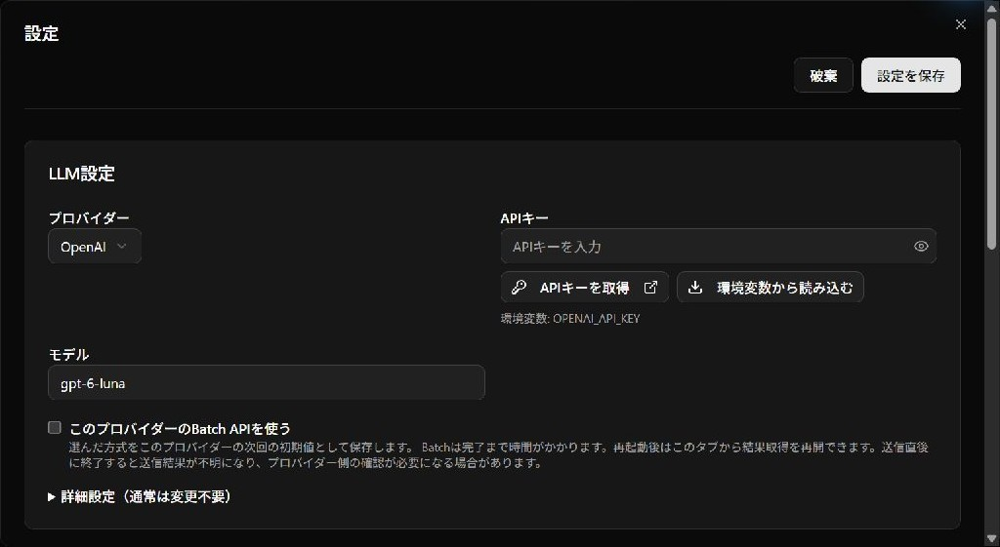
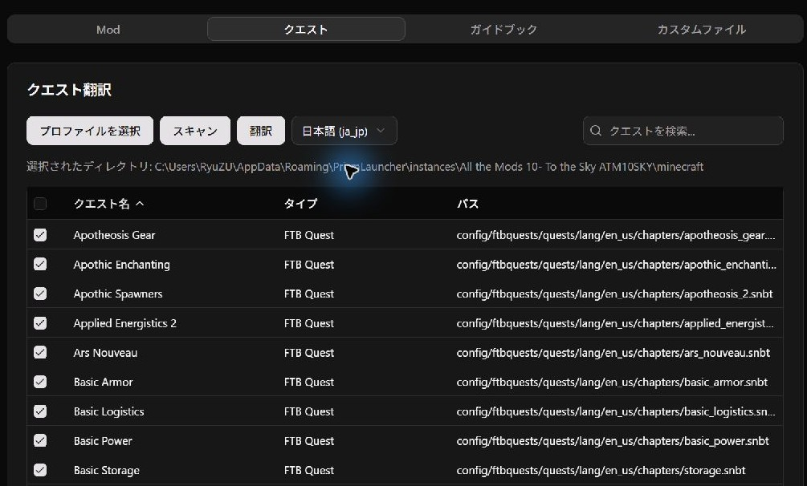
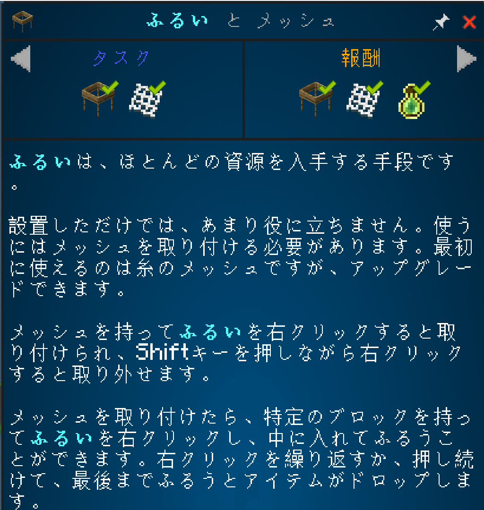

# Translate quests in 3 steps

[Download](https://github.com/Y-RyuZU/MinecraftModsLocalizer/releases/latest) · [日本語](ja/getting-started.md)

The screenshots show ATM10 SKY being translated into Japanese.

## 1. Set up your API key

Open the gear button → **LLM Settings**. Choose your provider, API key, and model, then **Save Settings**.
[Get an API key](api-key-setup.md) if you need one. Your provider charges for API usage.

## 2. Select quests and translate

Open **Quests → Select Profile** and choose your modpack's game folder (the one containing `mods` and `config`).
Choose the target language, **Scan**, check the files you want, and click **Translate**.

Choose **Standard API** for a quick result or **Batch** for a lower-cost bulk translation, then start. Batch may take up to 24 hours.

## 3. Read in Minecraft

When translation finishes, launch Minecraft, set the game language to your target language, and open the same quest.
Restart the game if it was already running.

---

**Want item names and descriptions too?** Repeat in **Mods**, then enable the generated resource pack in Minecraft. Use **Guidebooks** for supported in-game books.

[Resume Batch or troubleshoot](translation-help.md) · [Get an API key](api-key-setup.md)
