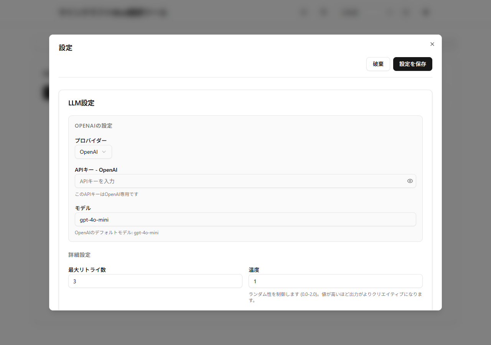
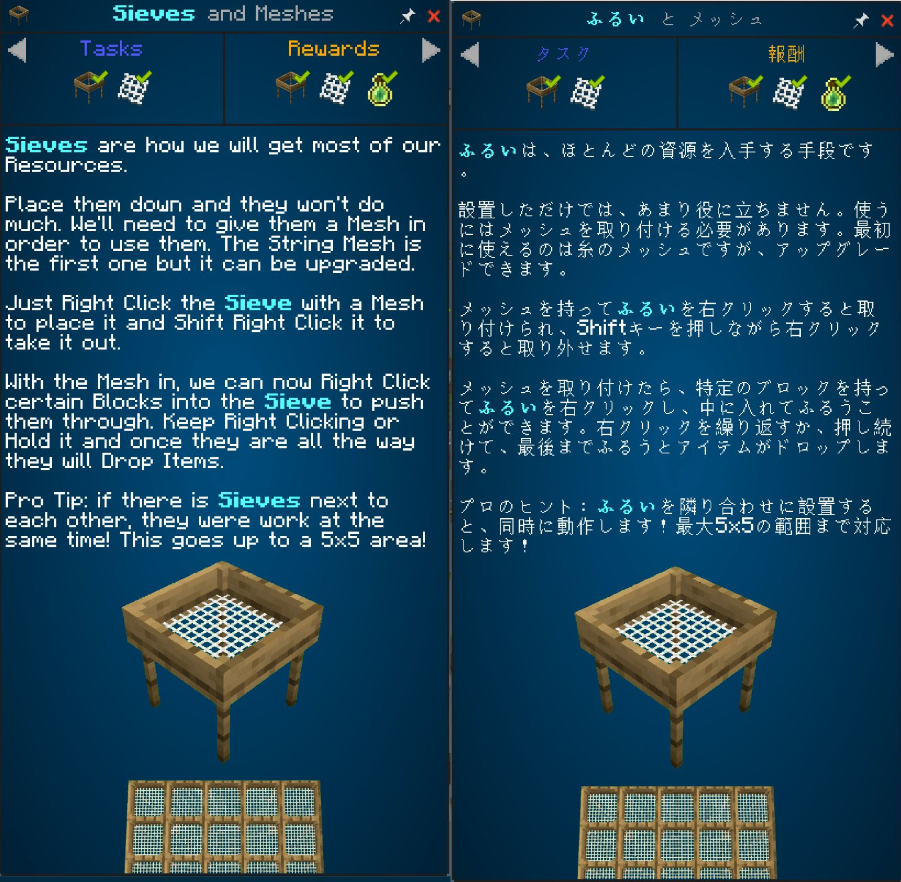

# クエスト・Mod・ガイドブックを翻訳する

[日本語](getting-started.md) | [English](../getting-started.md) | [README](../../README.ja.md)

英語のクエストや説明書を翻訳し、Minecraftの中で読むまでの手順です。**自分のAI APIキーが必要で、利用料はプロバイダーから請求されます。** まず目的に合う対象を1件だけ試し、表示を確認してから増やしましょう。

## 何を翻訳したいですか？

- [Modpackのクエスト](#クエストを翻訳する)：目標や進め方を読みたい。
- [Modのアイテム名・説明](#modを1つ翻訳する)：アイテムやブロックの名前を読みたい。
- [ゲーム内のガイドブック](#ガイドブックを翻訳する)：Modの説明書を読みたい。

最初に次の「インストール」と「共通の準備」を済ませてください。アプリ右上の**使い方**から、このガイドをいつでも開けます。

## インストール

[ダウンロードページ](https://github.com/Y-RyuZU/MinecraftModsLocalizer/releases/tag/v3.0.0)を開き、**Assets**からOSに合うファイルを選びます。このガイドはv3用です。

| 環境 | 選ぶファイルと起動方法 |
| --- | --- |
| Windows x64 | **`.exe`**をダウンロードして実行し、インストーラーの案内に従います。通常はこちらを選びます。`.msi`は英語のインストーラーです。 |
| Apple Silicon Mac | `aarch64-apple-darwin`を含む`.dmg`を開き、アプリをApplicationsへコピーします。 |
| Intel Mac | `x86_64-apple-darwin`を含む`.dmg`を開き、アプリをApplicationsへコピーします。 |
| Linux x64 | `.AppImage`に実行権限を付けて起動します。Debian/Ubuntuでは`.deb`も選べます。 |

`Source code`、`.sig`、`latest.json`、`.app.tar.gz`は通常のインストールには使いません。[ダウンロードの検証方法](../updater.md#verify-downloads)も用意しています。OSのコード署名・公証は行っていないため、起動時に警告や制限が出る場合があります。

初回の画面表示言語はOSに合わせます。右上で変更できます。**画面の言語と、ゲームの翻訳先言語は別です。** v2からはv3をインストールし、API設定を確認してください。

## 共通の準備

1. 翻訳したいModpackのインスタンスをバックアップし、Minecraftを終了します。
2. [APIキー取得ガイド](api-key-setup.md)でキーを用意します。
3. アプリ右上の歯車から**設定 → LLM設定**を開き、プロバイダー・APIキー・モデルを指定して**設定を保存**します。まず翻訳量やプロンプトの詳細設定は初期値のままで構いません。保存だけではAPI接続は確認されません。
4. 目的のタブで**プロファイルを選択**を押し、`mods`と`config`が入っているゲームフォルダーを選びます。Prism Launcherでは対象インスタンスの「フォルダー」を開き、その中の`minecraft`（環境によっては`.minecraft`）を確認します。Prism本体のインストール先ではありません。

## クエストを翻訳する

1. **クエスト**タブで、翻訳先を**日本語**にして**スキャン**します。
2. 一覧から対象を1件選び、**翻訳**を押します。1件がクエストブック全体の言語ファイルの場合もあるため、次の画面の**原文の項目数**も確認します。
3. 翻訳方式を選びます。
   - **すぐに進める — 通常API**：少量を試し、結果を早く確認したいとき。
   - **料金を抑える — Batch**：Modpackをまとめて翻訳し、待てるとき。対応モデルでは料金を抑えられますが、完了まで最大24時間かかる場合があります。
4. **翻訳を開始**を押します。ここからAPIへの送信が始まります。処理待ちの表示中もBatchはプロバイダー側で進みます。
5. 完了画面で成功・失敗件数を確認し、**保存先を開く**で出力を確認します。
6. 同じインスタンスのMinecraftを起動し、ゲームの言語を**日本語**にして、翻訳したクエストを開きます。クエスト本文が日本語で読めれば完了です。

ATM10 SKYのような言語ファイル形式では、翻訳先の言語ファイルを元と同じ場所に出力します。旧形式のクエストでは原文を置き換える場合があり、開始前に確認が表示されます。マルチプレイではサーバー側の反映が必要な場合があります。

### Batchの途中でアプリを閉じたとき

再起動後、同じタブの**Batchの結果取得を再開**を押します。元の対象・言語・設定が戻ります。元ファイルは変更しないでください。通常APIは再起動後の続行には対応していません。

送信直後に通信が切れ、送信IDを保存できなかった場合は二重送信を避けて停止します。プロバイダーの管理画面で確認してください。結果の保存期限を過ぎると再取得できない場合があります。アプリを閉じても、送信済みのAPI処理や料金の発生は止まりません。

## Modを1つ翻訳する

1. 共通の準備後、**Mod**タブで翻訳先言語を選び、**スキャン**します。
2. 未翻訳のModを1つ選び、**翻訳 → 通常API → 翻訳を開始**と進めます。大量ならBatchも選べます。
3. 完了画面で成功を確認します。
4. 同じインスタンスのMinecraftで**設定 → リソースパック**を開き、生成されたパックを有効にします。同じ項目を翻訳するパックがあれば、生成したパックを上に置きます。
5. ゲームの言語を翻訳先に合わせ、対象Modのアイテム名や説明を確認します。

## ガイドブックを翻訳する

1. 共通の準備後、**ガイドブック**タブで翻訳先言語を選び、**スキャン**します。Mod内の対応するPatchouliの本が対象です。
2. 本を選び、**翻訳**を押して方式を選び、**翻訳を開始**します。
3. 完了画面の出力先を確認し、Minecraftを再起動します。この機能はModのJARに翻訳を追加します。原本は同じ場所の`.mml-original.bak`に保存されます。Modを更新すると翻訳が失われる場合があります。
4. ゲームの言語を翻訳先に合わせ、同じ本の同じページを開きます。本文だけでなく、見出しのはみ出しやリンク先も確認します。

一覧に出ない本は、対応形式や配置を確認してください。すべてのModの本を翻訳できるわけではありません。

## 対象による使い分け

| 翻訳対象 | 操作と出力 |
| --- | --- |
| Modの言語ファイル、旧形式の`.lang` | **Mod**。生成したリソースパックをゲームで有効にします。 |
| FTB Quests | **クエスト**。章のSNBTは元ファイルを書き換える場合があるため、先にバックアップします。統合言語SNBTでは元の言語ファイルと同じ場所に翻訳先言語を出力します。 |
| Mod JAR内のPatchouli | **ガイドブック**。出力後、ゲーム内の本でも確認します。 |
| 自動検出されないJSON/SNBT | **カスタムファイル**。ファイルと出力先を指定します。出力名の先頭に言語IDが付くため、Modが読む名前・配置に合わせる必要があります。 |

**旧形式とパック固有の配置：** BetterQuestの`config/betterquesting/DefaultQuests.lang`は、原本を`.mml-original.bak`へ保存してから、ゲームが読む同じファイルへ適用します。Create: Astralの`resources/createastral/lang/en_us.json`はクエストタブで検出し、同じフォルダーの`ja_jp.json`へ出力します。以前のガイドにあった別名出力・手動コピーの説明は旧実装のものでした。マルチプレイのFTB Questsでは、サーバーからクエストを受信するためサーバー側にも翻訳が必要になる場合があります。

## 困ったとき

| 症状 | 次に確認すること |
| --- | --- |
| スキャンを押せない | 先にプロファイルを選択します。 |
| スキャン後も0件 | `mods`と`config`が入ったフォルダか、タブが対象に合っているかを確認し、検索フィルターを空にします。 |
| 翻訳を押せない | 翻訳先言語と1つ以上の項目を選択し、スキャンの終了を待ちます。 |
| 認証エラー、401/403 | キーとプロバイダーの組み合わせ、保存操作、アカウントやプロジェクトの権限を確認します。キーをissueに貼らないでください。 |
| モデルが見つからない、404 | アカウントで利用できるモデル名を入力します。既定値や保存済みの名前が提供終了している場合があります。モデル一覧はAPIキーガイドから確認できます。 |
| 利用枠・請求・429エラー | プロバイダー側の利用量・請求設定・速度制限を確認し、時間を置いて少量で再試行します。 |
| 文章量・出力上限のエラー | 設定でチャンクサイズを下げるか、トークンベースの分割を有効にします。 |
| JSON・翻訳応答のエラー | JSON出力を指定する既定のプロンプトを使い、処理量を減らしてログを確認します。部分的な出力を完成扱いにしないでください。 |
| 全項目がスキップされる | 「翻訳が存在する場合はスキップ」の設定と既存の翻訳先言語ファイルを確認します。 |
| 完了したのに英語のまま | 出力先・起動インスタンス・ゲーム言語・リソースパック優先順を確認します。クエストやカスタムファイルは読み込み対象の名前・配置も確認します。 |
| 中断後の再試行 | ログと完成した出力を先に確認します。すべての形式で中断地点から再開できるとは限りません。必要ならインスタンスのバックアップから戻します。 |
| 更新情報が見つからない | v2.1.3にはTauriの`latest.json`がありません。署名付きv3の公開まではReleasesから導入してください。 |

## 問い合わせに添える情報

[既存issue](https://github.com/Y-RyuZU/MinecraftModsLocalizer/issues)を確認し、アプリのバージョン・OS/CPU・MinecraftとModpackのバージョン・タブ・対象ファイルの相対パス・期待した結果・実際の結果・エラー文を添えます。APIキー、アカウント情報、個人名を含む絶対パスは除いてください。公開可能な最小サンプルがあると形式の問題を再現しやすくなります。`config.json`は添付しないでください。
